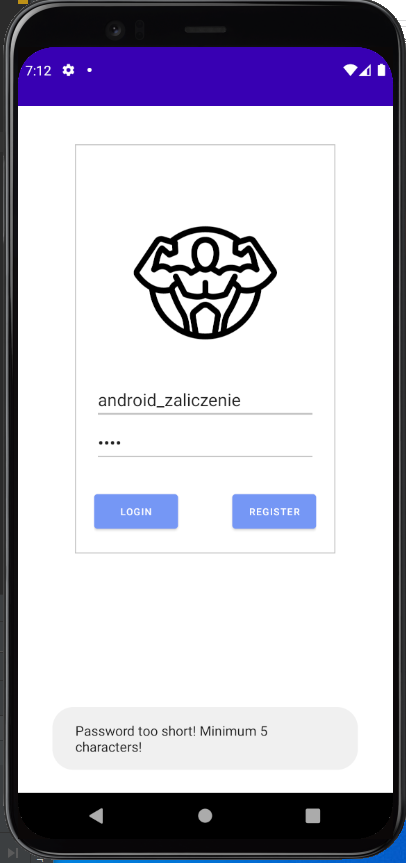
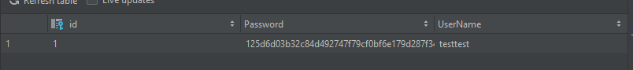
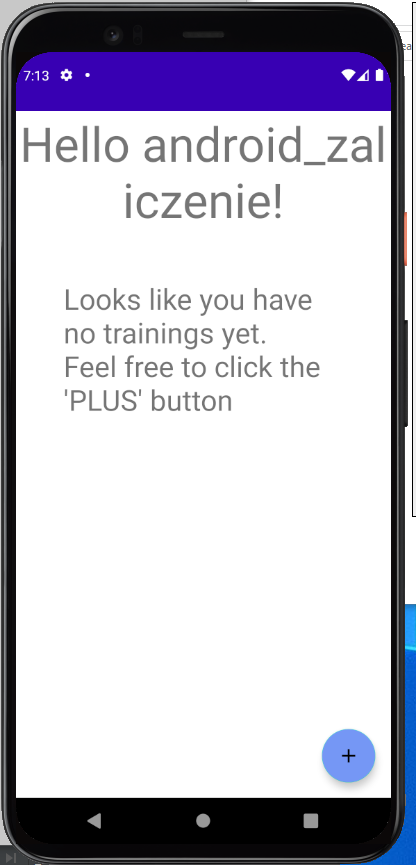
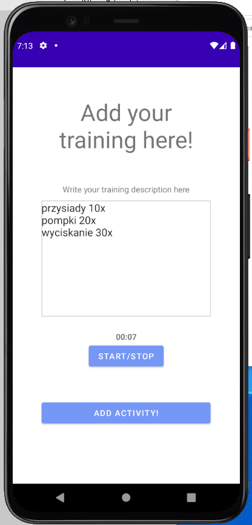
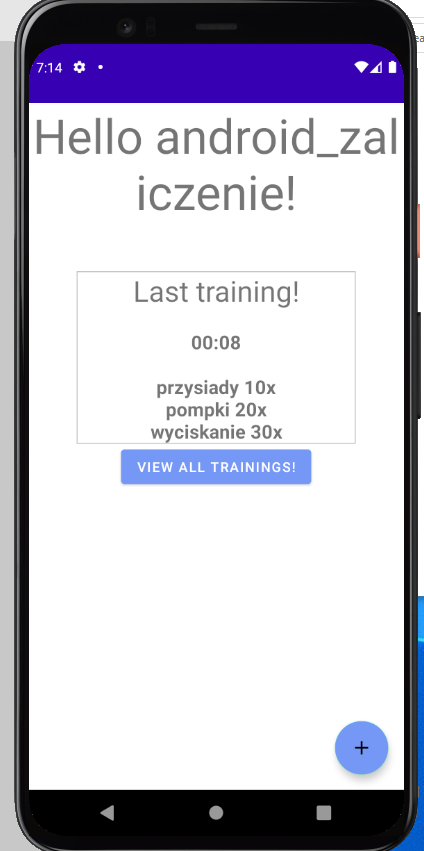
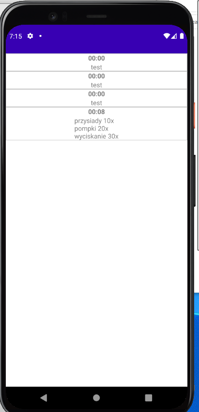

# Activitymanager

# Opis
Aplikacja umożliwiająca tworzenie konta użytkownika w lokalnej bazie danych SQLite, dodawanie do niego treningów/aktywności oraz przeglądanie ich historii.

# Biblioteki
Room - ORM dla SQLite
Hilt - Biblioteka do Depedency Injection

# Applcation flow - screenshoty i opis

Podstawowa walidacja danych.

Zahashowane haslo w tabeli user

Glowny ekran jesli uzytkownik nie ma dodanego zadnego treningu.

Ekran gdzie uzytkownik dodaje opis swojego treningu oraz gdzie uruchamia customowy timer aby dodać jego wartość do tabeli.

Glowny ekran jesli uzytkownik posiada dodany trening.

Ekran wyswietlajacy historie treningów korzystający z RecyclerView
