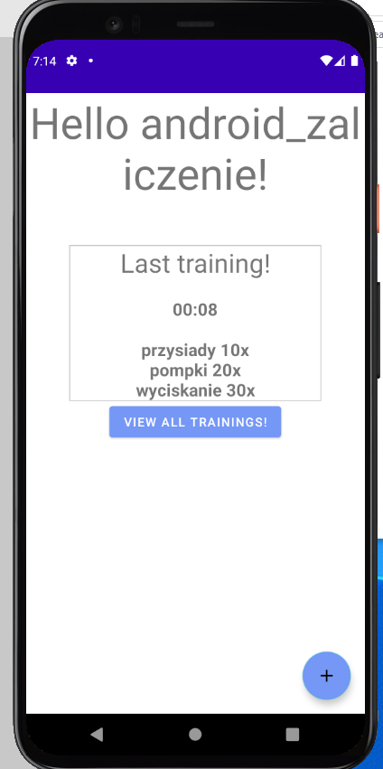

# Activitymanager

# Opis
Aplikacja umożliwiająca tworzenie konta użytkownika w lokalnej bazie danych SQLite, dodawanie do niego treningów/aktywności oraz przeglądanie ich historii.

# Biblioteki
Room - ORM dla SQLite
Hilt - Biblioteka do Depedency Injection

# Applcation flow - screenshoty i opis

